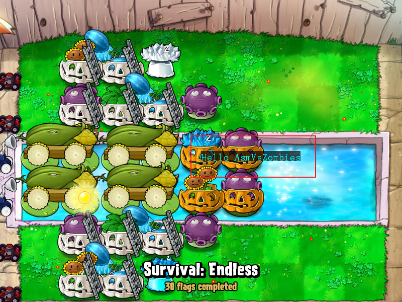

<!--
 * @Coding: utf-8
 * @Author: vector-wlc
 * @Date: 2022-11-18 17:48:15
 * @Description: 
-->
# Hello AsmVsZombies

粘贴以下代码可在 PvZ 的窗口中央显示一个维持 5s 的 `Hello AsmVsZombies`

```C++
#include <avz.h>  // 包含本框架的头文件

// 本框架的普通入口函数是 `void AScript()`
void AScript()
{
    // 注意此条代码需要到选卡界面或者战斗界面才能看到运行效果
    aPainter.Draw(AText("Hello AsmVsZombies", 400, 300), 500);
}
```

如果你的显示结果和下图一样，那么恭喜你已经安装好了本框架



此外，本框架依然有协程版本的入口函数

```C++
#include <avz.h> // 包含本框架的头文件

// 本框架的协程入口函数是 `ACoroutine ACoScript()`
// 使用协程入口函数可以很方便的使用阻塞功能
// 此功能后续会有展示
ACoroutine ACoScript()
{
    // 注意此条代码需要到选卡界面或者战斗界面才能看到运行效果
    aPainter.Draw(AText("Hello AsmVsZombies", 400, 300), 500);
    co_return;
}
```


[目录](./0catalogue.md)