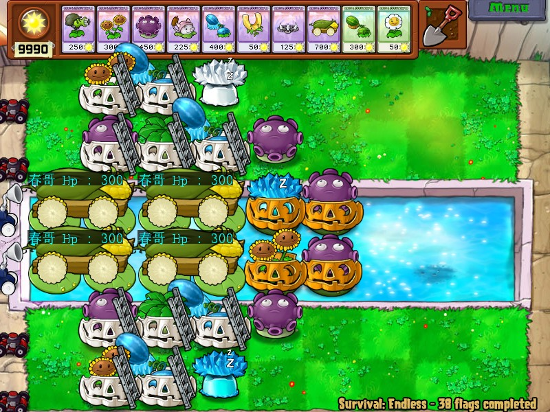

<!--
 * @Coding: utf-8
 * @Author: vector-wlc
 * @Date: 2022-11-19 20:48:03
 * @Description: 
-->
# 绘制类

本框架中支持对 PvZ 的画面进行绘制，使用此功能需要使用绘制类 `APainter`

咱们先看看他的接口

```C++
 // 设置字体
    // 使用示例
    // SetFont("黑体") ------ 将字体设置为黑体
    void SetFont(const std::string& name);

    // 设置字体大小
    // 使用示例
    // SetFontSize(15) ------ 将字体大小设置为 15
    // 注意此处字体大小不一定与 MS Word 中的相同
    void SetFontSize(int size);

    // 设置文本颜色
    // 使用示例
    // 注意每个参数范围为 [0, 255]
    // SetTextColor(AArgb(0xff, 0, 0, 0)) ----- 将文本的不透明度设置为 0xff, 也就是不透明, 色彩设置为 RGB(0, 0, 0), 也就是黑色
    void SetTextColor(DWORD color);

    __ANodiscard DWORD GetTextColor();

    // 设置矩形框颜色
    // 使用示例
    // 注意每个参数范围为 [0, 255]
    // SetRectColor(AArgb(0xff, 0, 0, 0)) ----- 将矩形框的不透明度设置为 0xff, 也就是不透明, 色彩设置为 RGB(0, 0, 0), 也就是黑色
    void SetRectColor(DWORD color);

    __ANodiscard DWORD GetRectColor();

    // 绘制函数
    // 第一个参数指的是绘制什么: 文本还是矩形
    // 第二个参数指的是绘制的持续时间
    // 绘制文本
    // ***使用示例
    // Draw(AText("hello", 100, 100)) ------ 在游戏画面(100, 100) 处绘制 hello
    // Draw(AText("hello", 100, 100, RIGHT_TOP)) ------ 在游戏画面(100, 100) 处绘制 hello, 并且文本绘制是在 (100, 100) 的右上方
    // 绘制矩形
    // ***使用示例
    // Draw(ARect(100, 100, 200, 200)) ------ 在游戏画面(100, 100) 处绘制宽高为 (200, 200) 的矩形, 默认显示 1cs
    // Draw(ARect(100, 100, 200, 200), 100) ------ 在游戏画面(100, 100) 处绘制宽高为 (200, 200) 的矩形, 显示 100cs
    void Draw(const ARect& rect, const ARunOrder& runOrder = ARunOrder(0));
    void Draw(const AText& posText, const ARunOrder& runOrder = ARunOrder(0));
    void Draw(const ARect& rect, int duration, const ARunOrder& runOrder = ARunOrder(0));
    void Draw(const AText& posText, int duration, const ARunOrder& runOrder = ARunOrder(0));
```

其实这里面用的最多的是最后的 Draw 函数，Draw 函数我们可以到看到有四个重载方式，在介绍 Draw 函数之前，我们首先需要知道 ARect 和 AText 这两个结构体是什么，这两个结构体实际上就是告诉 Draw 函数需要绘制的内容

```C++

ARect(100, 100, 200, 200) // 创建一个矩形，矩形默认出现在 (100, 100) 的右下方, 矩形的宽高为 (200, 200)
ARect(100, 100, 200, 200, APos::LEFT_TOP) // 创建一个矩形，矩形出现在 (100, 100) 的左上方, 矩形的宽高为 (200, 200)

AText("hello", 100, 100) // 创建一个字符串, 内容为 "hello", 字符串默认出现在 (100, 100) 的右下方，并且字符串默认有背景
AText("hello", 100, 100, APos::LEFT_BOTTOM, false) // 创建一个字符串, 内容为 "hello", 字符串出现在 (100, 100) 的左下方，并且字符串没有背景
```

在了解了这两个结构体之后，我相信 Draw 的第一个参数是什么意思了，那么 Draw 是有第二个参数的，第二个参数是绘制持续时间，首先 Draw 函数有一个默认的绘制时间，就是持续 1cs，还记得咱们的 hello AsmVsZombies 程序吗，

```C++
#include <avz.h>  // 包含本框架的头文件

// 本框架的入口函数是 `void AScript()`
void AScript()
{
    // 注意此条代码需要到选卡界面或者战斗界面才能看到运行效果
    aPainter.Draw(AText("Hello AsmVsZombies", 400, 300), 500);
}
```

现在我相信你已经理解了这条代码的真正含义，是的！他持续了 500cs。

OK, 有了以上的介绍，我们就开始正式介绍这个玩意有啥用吧，首先，咱们可以用它显示一些特定植物的内存信息
对了，你可能疑惑这个 aPainter 咋就突然冒出来，实际上这是一个本框架预定义好的 `APainter` 类对象，
如果你想整好几个 APainter, 那你就使用 `APainter` 创建多个就行。

```C++
#include <avz.h>

#include <avz.h>

void DrawCobHp()
{
    for (auto&& plant : aAlivePlantFilter) {
        if (plant.Type() == AYMJNP_47) {
            // 注意，AText 的第一个参数只接受字符串类型，plant.Hp() 返回值是一个整型
            // 所以不能直接使用，需要使用 std::to_string 函数将其转为字符串类型才能绘制
            aPainter.Draw(AText("春哥 Hp : " + std::to_string(plant.Hp()),
                plant.Abscissa(), plant.Ordinate()));
        }
    }
}

ATickRunner tickRunner;

void AScript()
{
    AConnect(ATime(1, -599), [] {
        tickRunner.Start(DrawCobHp);
    });
}
```

上述的代码非常简单，首先读内存看一下这个植物是不是炮，如果是炮，就在他的位置处绘制一个字符串，字符串的内容就是他的血量，对就是这么简单，那么我们看一下运行结果




[目录](./0catalogue.md)