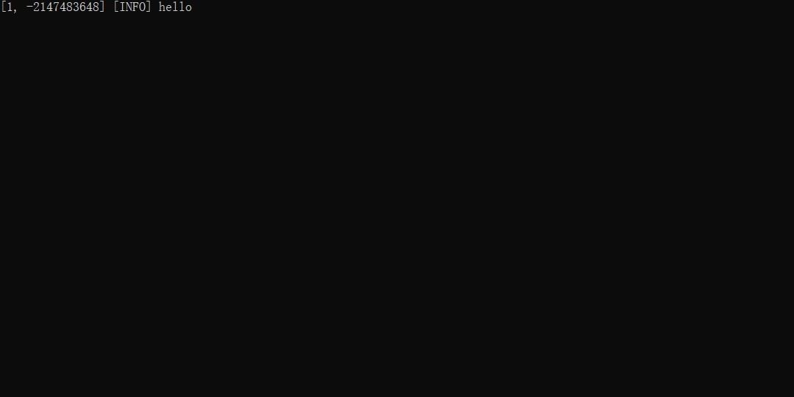
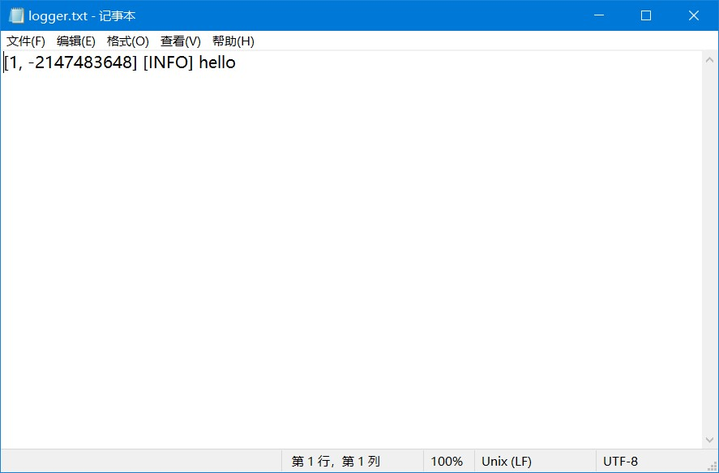

<!--
 * @Coding: utf-8
 * @Author: vector-wlc
 * @Date: 2022-11-19 22:57:13
 * @Description: 
-->
# 日志功能

没想到吧，本框架是有日志功能的，咱们现在就开始介绍。

首先，本框架的日志功能由 `ALogger` 类实现的，他有以下四种创建方式。

```C++
#include <avz.h>
ALogger<AMsgBox> msgBoxLogger;           // 这个日志对象呈现日志的方式是弹出窗口
ALogger<AConsole> consoleLogger;         // 这个日志对象呈现日志的方式是控制台
ALogger<AFile> fileLogger("logger.txt"); // 这个日志对象呈现日志的方式是输出到文件 logger.txt 中
ALogger<APvzGui> pvzGuiLogger;           // 这个日志对象呈现日志的方式是在 PvZ 界面中显示

void AScript()
{
    msgBoxLogger.Info("hello");
    consoleLogger.Info("hello");
    fileLogger.Info("hello"); // 注意由于只写了相对路径，所以它默认将 logger.txt 保存在 pvz 可执行程序路径下
    pvzGuiLogger.Info("hello");
}
```

咱们看看上述代码的运行结果

msgBoxLogger


consoleLogger



fileLogger



pvzGuiLogger


你可能会有疑惑，这个 [1, -2147483648] 是个什么玩意，实际上这指的是游戏当前时间，但是由于咱们是在选卡界面显示的日志，
所以自然就没有这个时间，因为只有战斗界面才有时间，因此本框架就返回了一个这样的值，后面的中括号的内容显示的是显示级别

```C++
// 本框架分为以下四个日志级别
ALogLevel::DEBUG;
ALogLevel::INFO;
ALogLevel::WARNING;
ALogLevel::ERROR;
```

下面介绍一下如何设置打印级别

```C++
msgBoxLogger.SetLevel({ALogLevel::DEBUG, ALogLevel::WARNING});
msgBoxLogger.Debug("Debug");     // 显示
msgBoxLogger.Info("Info");       // 不显示
msgBoxLogger.Warning("Warning"); // 显示
msgBoxLogger.Error("Error");     // 不显示
```

由于上述代码 msgBoxLogger 设置显示级别为 ALogLevel::DEBUG, ALogLevel::WARNING, 所以只有 Debug 和 Warning 级别的日志才会输出显示，别的级别的都不会进行输出。

接着咱们介绍一下如何设置日志对象的输入格式

```C++
// 格式化字符串默认为 #
consoleLogger.Info("时间是:#", 5);  // 输出结果: [1, -2147483648][INFO] 时间是:5
// 将格式化字符串默认 # 变为 {}
consoleLogger.SetPattern("{}");
consoleLogger.Info("时间是:#", 5);  // 输出结果: [1, -2147483648][INFO] 时间是:#
consoleLogger.Info("时间是:{}", 5);  // 输出结果: [1, -2147483648][INFO] 时间是:5

// 设置日志头部格式 
// 头部时间格式有四个重要字符分别是，pattern (格式化字符)，wave, time, level
// 真正使用的时候需要将 pattern 和其他三个组合起来
// 例如如果格式化字符是 {} 那么 "{}wave" 将会被替换为日志输出时游戏的波数
consoleLogger.SetHeaderStyle("({}level)({}wave, {}time)");
consoleLogger.Info("时间是:{}", 5); // 输出结果是: (INFO)(1, -2147483648) 时间是:5

// 将头部设置为空
consoleLogger.SetHeaderStyle("");
consoleLogger.Info("时间是:{}", 5); // 输出结果是:  时间是:5
```

## 设置框架内部日志对象

在框架的使用过程中，你应该能看出来，本框架默认用的日志类是 `ALogger<AMsgBox>`，为什么用它呢，是因为他的报错提示最明显，而且框架默认将他的日志级别设置为 ALogLevel::WARNING 和 ALogLevel::ERROR，但是你可能觉得很不好，你可能想用一个控制台看框架内部的输出内容，那么你需要这样做

```C++
#include <avz.h>
ALogger<AConsole> consoleLogger;         // 这个日志对象呈现日志的方式是控制台

void AScript()
{
    // 将框架内部 INFO WARNING ERROR 等级的日志全部输出
    consoleLogger.SetLevel({ALogLevel::INFO, ALogLevel::WARNING, ALogLevel::ERROR}); 
    // 设置框架内部日志对象为自己想要的对象
    ASetInternalLogger(consoleLogger);
}
```
##  自定义日志类

看到这，你可能还会有别的想法，我能不能实现这样一种日志对象，他在 INFO 的时候用控制台，DEBUG 的时候用文件，ERROR 的时候用 msgBox 呢？很明显这样的需求本框架没有封装，所以你需要自己写一个，大致写法如下

```C++
#include <avz.h>

ALogger<AMsgBox> msgBoxLogger;           // 这个日志对象呈现日志的方式是弹出窗口
ALogger<AConsole> consoleLogger;         // 这个日志对象呈现日志的方式是控制台
ALogger<AFile> fileLogger("logger.txt"); // 这个日志对象呈现日志的方式是输出到文件 logger.txt 中
ALogger<APvzGui> pvzGuiLogger;           // 这个日志对象呈现日志的方式是在 PvZ 界面中显示

class MyLogger : public AAbstractLogger {

protected:
    // 重写日志抽象基类的虚函数
    virtual void _Output(ALogLevel level, std::string&& str) override
    {
        if (level == ALogLevel::INFO) {
            consoleLogger.Print(str);
        } else if (level == ALogLevel::DEBUG) {
            fileLogger.Print(str);
        } else if (level == ALogLevel::ERROR) {
            fileLogger.Print(str);
        } // 这里就不写 WARNING 的了，不写会导致 WARNING 没有输出
    }
};

MyLogger logger;
void AScript()
{
    logger.Info("hello"); // 输出 [1, -2147483648][INFO] [1, -2147483648][INFO] hello
    logger.Debug("hello");
    logger.Error("hello");
}
```

此时你可能疑惑为啥他重复输出了两次日志头，实际上很简单，因为当你调用 Info 函数的时候，他会先为字符串加上一个日志头，
然后日志头经过格式化处理再给咱们重载的 _Output 函数，因此 _Output 函数此时接收到的 std::string&& str 中就含有了文件头，
然后此时又调用了相应的日志对象的函数，此时又会加上一个日志头，因此就输出了两次，解决这个问题的办法就是

```C++
logger.SetHeaderStyle("")
```

OK，我相信你已经看懂了代码了。就不再解释了

[目录](./0catalogue.md)