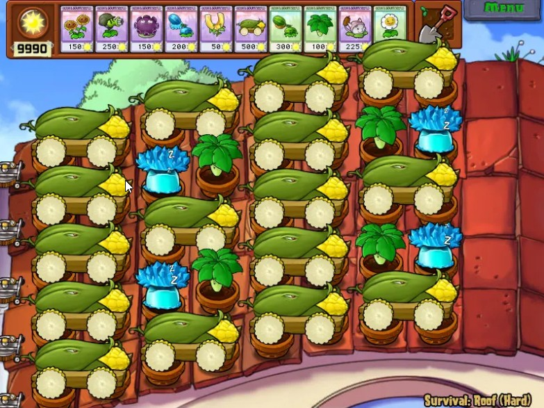

<!--
 * @Coding: utf-8
 * @Author: vector-wlc
 * @Date: 2021-09-25 18:45:59
 * @Description: 
-->

# 炮操作类——炮序排布

回到炮操作类设计之初要解决的问题——炮序排布，通过前几篇文章的说明，我想信大家已经对炮操作类有了一个比较全面的认识，此篇文章我们就灵活运用炮操作类帮助我们排炮序，接下来分几种的具体情况来讨论。

## 非天台场景

当场景为非天台场景时，多炮列表的存在意义不是很大，因为平地场景炮的飞行时间，落点偏移都是相同的，因此大部分情况一个炮列表是够用的。

### 无铲种炮

这种情况最为简单，不论使用哪种炮序模式，都可以轻松的胜任。
原地铲种 + 不关心铲种位置
这种情况推荐大家使用 时间使用模式 + `fixLatestPao` 的组合，由于不关心铲种位置，这种组和可以说是最适合这种情况的了，可以省去基本所有的麻烦。

### 原地铲种 + 关心铲种位置

由于关心铲种位置，这种情况下使用 `fixLatestPao` 就显得很勉强，但是也不是不能使用，我们需要知道当前炮发射到了哪门。因此在这种情况下，一种解决方案是使用空间使用模式，让炮的发射顺序完全掌握在我们的手中，但是这带来了一个麻烦，需要使用 `resetPaoList` 不断调整炮序；因此还有另一种解决方案，那就是不把铲种炮看作炮，而把他当作卡，这种思路的具体做法就是不将铲种炮录入炮列表中，并且铲种炮使用 `rawPao` 发射，之前我们提到过，`rawPao` 可以发射场地上真实存在的炮，不管他是否在炮列表中。而剩下的非铲种炮都放在一个列表里，这样就基本不用使用 `resetPaoList` 调整炮序了。

### 位移铲种
 
由于是位移铲种，我们肯定关心铲种的位置，因此这种情况和上一种的解决思路相同，不把铲种炮写在炮列表里，使用 `rawPao` 函数发射铲种炮，将剩下的非铲种炮都放在一个列表里。

## 天台场景

当场景为天台场景时，多炮列表的存在就变的有意义了，因为天台场景炮的落点偏移不是相同的，因此如果只使用一个炮列表会使得炮序排布变得非常困难。
天台排炮序的大致思路是将所在列相同的炮放在一个炮列表中，

例如 RE 18


我们可以这样做:

```C++
// 分配四个炮列表，分别是
AvZ::PaoOperator pao_1col;
AvZ::PaoOperator pao_3col;
AvZ::PaoOperator pao_5col;
AvZ::PaoOperator pao_7col;

void Script(){
    // 为其分配炮
    pao_1col.resetPaoList({{1, 1}, {2, 1}, {3, 1}, {3, 1}, {5, 1}});
    pao_3col.resetPaoList({{1, 3}, {2, 3}, {3, 3}, {3, 3}, {5, 3}});
    pao_5col.resetPaoList({{1, 5}, {2, 5}, {3, 5}, {3, 5}, {5, 5}});
    pao_7col.resetPaoList({{1, 7}, {2, 7}, {3, 7}});
}
```

这样我们使用相应的对象调用相应的炮函数就可以发射相应位置的炮了，当然我们还可能会有一个疑问第三列和第五列的炮可以作为两用炮，那么我们可以再设置一个炮列表
```C++
// 分配五个炮列表，分别是
AvZ::PaoOperator pao_1col;
AvZ::PaoOperator pao_3col;
AvZ::PaoOperator pao_5col;
AvZ::PaoOperator pao_7col;
AvZ::PaoOperator liang_yong; // 两用炮

void Script(){
    // 为其分配炮
    pao_1col.resetPaoList({{1, 1}, {2, 1}, {3, 1}, {3, 1}, {5, 1}});
    pao_3col.resetPaoList({{1, 3}, {2, 3}, {3, 3}, {3, 3}, {5, 3}});
    pao_5col.resetPaoList({{1, 5}, {2, 5}, {3, 5}, {3, 5}, {5, 5}});
    pao_7col.resetPaoList({{1, 7}, {2, 7}, {3, 7}});
    liang_yong.resetPaoList({{1, 3}, {2, 3}, {3, 3}, {3, 3}, {5, 3}, {1, 5}, {2, 5}, {3, 5}, {3, 5}, {5, 5}});
}
```

在 AvZ 中这样做是允许的，**一枚炮可以被多个炮列表所占用**，这样当我们使用 liang_yong 这个对象发射炮时，其必会发射位于第三列和第五列的炮，当然如果你觉得这样还不够灵活，可以再创建一个 all_pao 对象来包含场地上所有的炮，这样使用 all_pao 对象就可以发射场地上任意位置的炮了。
这里有一个例子，天台原地铲种：

其示例脚本链接： https://gitee.com/vector-wlc/AsmVsZombies/blob/master/script/210820/RECaoDong16.cpp 。

当天台场景含有位移铲种时，仍推荐大家将铲种炮放在炮列表外并使用 `rawPao` 函数发射，至于应该使用时间使用模式还是空间使用模式，应由具体情况来决定，这两种模式没有孰优孰劣的说法，更适合阵型排炮序的模式就是优的。

上面讨论只是基于我的个人观点，如果对炮操作类和炮序排布有更好的意见与建议，欢迎联系我。