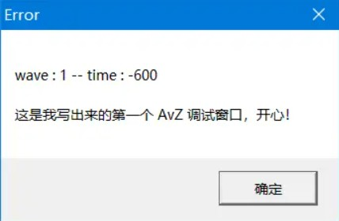
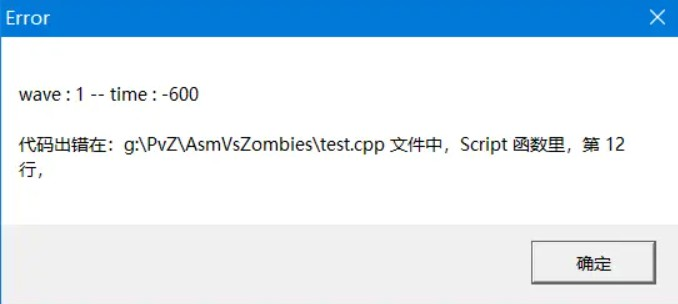
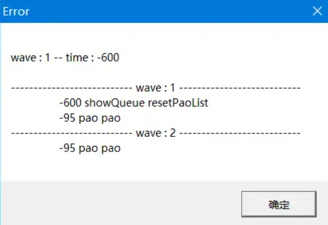
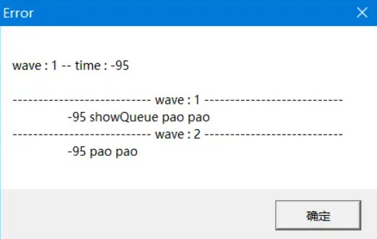
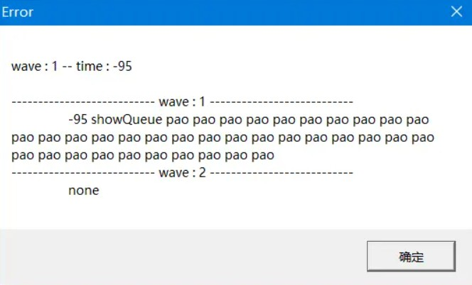
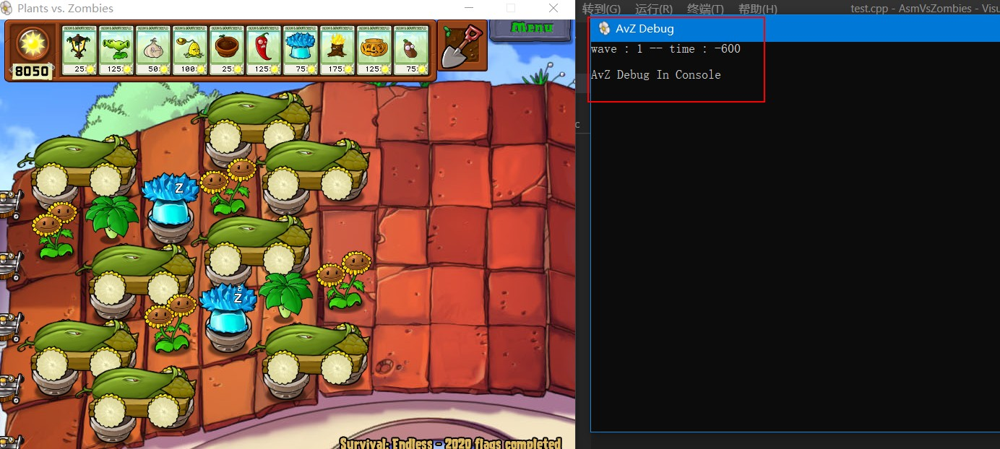

<!--
 * @Coding: utf-8
 * @Author: vector-wlc
 * @Date: 2021-09-25 21:30:42
 * @Description: 
-->
# 运行调试

掌握调试方法对于我们快速找出代码中的错误至关重要，在视频教程中，我们介绍了如何读取 C++ 编译器给我们提示的静态代码错误，那说到这里，什么是静态错误呢？静态错误其实就是编译器将我们所写的代码编译成动态库或可执行程序时，编译器发现了我们的代码有一些非常简单的写法错误，比如结尾漏写分号，将 {} 错写成 () 等等，其实静态错误就是不需要运行程序就会发现的错误，这类错误由于编译器会给我们充分的信息提示，因此比较好解决，占用的时间也是比较少的，但是还有一种错误，就是我们的脚本没有语法错误，并且可以执行时发生了一些不符合我们预期的错误，比如该放的炮没放出来，该用的卡没用，这类错误就属于运行时错误，一般耗费我们大量时间的就是这类错误，因为这类错误基本没有辅助工具提示我们哪里错了，只能通过我们不断的用眼睛扫描代码去寻找，但是一些错误是非常隐蔽的，我们可能把眼睛扫瞎了都找不到错误在哪里，为了方便大家找出这类错误，AvZ 提供了三个函数来调试。

## `ShowError`

```C++
#include "avz.h"

void Script()
{
    SetTime(-600, 1);
    AvZ::ShowError("这是我写出来的第一个 AvZ 调试窗口，开心！");
}
```

注意 `ShowError` 的属性为 In Queue，因此使用上述代码，在游戏运行到（-600，1）时，会弹出来这样一个窗口：




那大家可能说，这个东西有啥用，不就是弹出来个窗口吗？看起来好像确实没啥用，但是仔细一想，如果我们在脚本里没有按照预期运行的操作之前使用这条语句就可以知道到底是操作没有录入操作队列还是操作录入了操作队列而 AvZ 没有正常执行操作，例如：
```C++
#include "avz.h"

void Script()
{
    SetTime(-600, 1);
    AvZ::ShowError("这是我写出来的第一个 AvZ 调试窗口，开心！");
    pao_operator.pao(2, 9);
}
```

比如我们第一次运行脚本发现在（-600，1）这个时间点并没有放炮，那我们就可以在他前面放一个 `ShowError`，如果我们发现弹出来了这个窗口，就说明 pao 这个操作大概率被录入了操作队列，因此问题出在操作队列的执行上，这时候大概率是框架的 BUG，就需要尽快的向我反馈；如果没有弹出窗口，那说明这一块的代码压根就没有执行，这个时候就需要看看自己写的代码是否被 if 条件屏蔽了等等。当然 `ShowError` 可以放可变参数，什么意思呢？例如下面的代码：
```C++
#include "avz.h"

void Script()
{
    SetTime(-600, 1);
    AvZ::ShowError("代码出现在：# 文件中， # 函数里， 第 # 行，", __FILE__, __func__, __LINE__);
}
```

就会弹出下面的窗口：




这个窗口显示出来了出错的文件，出错的函数以及出错的行数，直接定位了错误的位置，大大方便了我们找窗口从哪弹出来的，当然上述代码中用到了一些宏，大家只要照葫芦画瓢使用就行，不用了解其具体含义，这里需要说明的是，双引号中内容为 # 的符号将会被双引号后面的内容所替换，这部分读者使用过 C 语言中的 printf 函数会非常容易理解，当然，不知道 printf 函数也没关系，其实只要掌握最开始的那种调用形式就可以应付绝大多数调试情况。

除了 `ShowError` 外，还有一个 `ShowErrorNotInQueue`，其实这个函数大家应该非常清楚，其实就是 `ShowError` 不会录入操作队列版，就是立即执行版，除此之外，使用方法与 `ShowError` 完全相同，在此不在赘述。

## `ShowQueue`

见名知意，就是显示操作队列内容的函数，这个函数十分好用，它的属性为 In Queue。

```C++
SetTime(-600, 1);
ShowQueue({1, 2});
```

上面的代码就是在（-600，1）这个时间点显示出第1、2波操作队列中当前时间点正在执行或未被执行的内容，结果如下



如果我们在（-95，1）这个时间点调用结果如下
```C++
SetTime(-95, 1);
ShowQueue({1, 2});
```


看，在（-600，1）时间点的操作将不会显示出来，因为操作队列执行过的操作已经出队了，那这个函数对调试有啥作用呢？比如我们手贱把下面代码中的wave 写成了 1，
```C++
for (int wave = 1; wave < 21; ++wave) {
    SetTime(-95, wave);
    pao_operator.pao({{2, 9}, {5, 9}});
}
```
形成了下面的代码
```C++
for (int wave = 1; wave < 21; ++wave) {
    SetTime(-95, 1);
    pao_operator.pao({{2, 9}, {5, 9}});
}
```


那么 AvZ 在（-95，1）这个时间点肯定会爆出一大堆炮不够用的错误，然后我们一脸懵逼，怎么可能，这不可能！肯定是 AvZ 框架出 BUG 了，绝对不是我的锅（/滑稽），但是如果这个时候我们使用 `showQueue` 的话，就会明显看出错误了
```C++
SetTime(-95, 1);
ShowQueue({1, 2});
```


我们会惊喜的发现第一波的操作贼多，然而第二波的操作竟然为 none ！！！这个时候我们就会立即意识到自己哪些地方写错了。当然 `ShowQueue` 函数的参数形式就是填的是啥数字他就会显示数字波的操作，例如 `ShowQueue({9})` 就会显示第九波的操作  `ShowQueue({10, 11})` 就是显示第 10、11 波的操作。

## 调试模式设定 

AvZ 的调试不仅仅可以将结果以窗口的形式的方式弹出来，还可以进行一定的设置

```C++
// 报错将会有弹窗弹出
AvZ::SetErrorMode(AvZ::POP_WINDOW);

// 报错将会显示在控制台
AvZ::SetErrorMode(AvZ::CONSOLE);

// 取消报错功能
AvZ::SetErrorMode(AvZ::NONE);
```

比如下面代码：
```C++
#include "avz.h"

void Script()
{
    AvZ::SetErrorMode(AvZ::CONSOLE);
    AvZ::SetTime(-600, 1);
    AvZ::ShowError("AvZ Debug In Console");
}
``` 
运行效果如下：



将模式设置为控制台的好处就是报错时并不会阻塞游戏的运行。