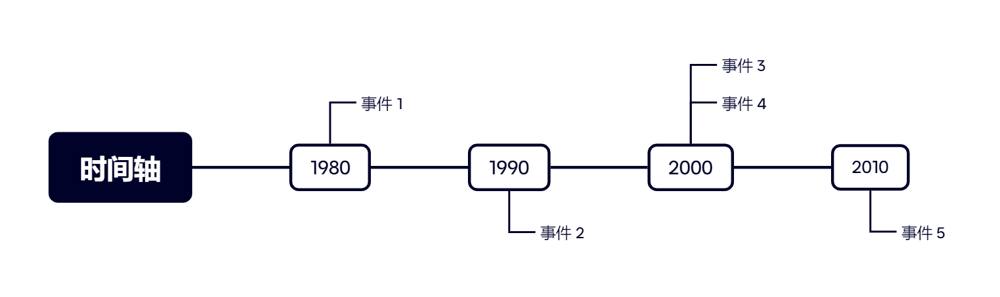

# 1 时间轴是什么

时间轴是 DSL 中的基本组件。说起时间轴，你可能会想到类似这样的图片：



AvZ 中的时间轴（`ATimeline`）也与之类似。具体而言，时间轴是一系列操作的集合，每个操作对应一个**相对的**生效时间。什么叫相对时间呢？先举一个例子：

```cpp
ATimeline a = At(-100_cs) Card(ACHERRY_BOMB, 2, 9);
```

我们暂且不考虑其中的语法细节。可以看出，这行代码的两个关键元素是 `-100_cs` 和 `Card(...)`。前者是相对时间，后者是实际执行的操作。

这时有人可能要问了：定义它的过程中根本没有指定波次，那这个操作被连接到了哪波的 -100cs 啊？答案是：这行代码并没有把操作连接到任何地方。**时间轴需要连接到绝对时间才能生效。**就像这样：

```cpp
AConnect(ATime(1, 359), a);
```

在连接一个时间轴时，AvZ 会把每项操作的相对时间（此例中是 -100cs）加到连接的绝对时间（此例中是 (1, 359)）上，以计算出这个操作的实际执行时机。因此，这个樱桃会在第 1 波的 260cs 时放置。

此外，两个时间轴还可以合并：

```cpp
ATimeline p = At(-373_cs) Do { aCobManager.Fire(2, 9); };
ATimeline a = At(-100_cs) Do { ACard(ACHERRY_BOMB, 5, 9); };
AConnect(ATime(1, 401), p & a);
```

这相当于：

```cpp
AConnect(ATime(1, 401 - 373), []{ aCobManager.Fire(2, 9); });
AConnect(ATime(1, 401 - 100), []{ ACard(ACHERRY_BOMB, 5, 9); });
```

注意到一件事：`ATimeline` 版本的代码中，`401` 是写在 `AConnect` 里的，而 `-373` 和 `-100` 是写在两个时间轴的定义处的。为什么要作这样的区分？都写在一处不好吗？

想想你在内心思考阵解时，是不是先想着“我要让炮在 401cs 生效”，然后再在脚本里写下 `401 - 373` 这样的数值？对于各种操作，我们往往更加关心其**生效时间**而非**操作时间**。把 `-373_cs` 绑定到发炮操作上就起到了把后者转换为前者的效果。你只需要在 `AConnect` 里写下预期的生效时间，AvZ 内部就会自动计算好对应的操作时间。是不是很方便？

更重要的一点是：这些时间轴操作可以被**预先封装**。使用 DSL 自带的封装好的时间轴，上一个例子可以写成：

```cpp
AConnect(ATime(1, 401), P(2, 9) & A(5, 9));
```

这就是时间轴语法的最大优势：它可以通过封装避免脚本中避免大量的时间加减，让脚本更加易写、易读。

相信读者已经理解了 DSL 存在的意义。后面的章节将会逐一介绍 DSL 的语法，并一步步地构建完整的 DSL 脚本。

[目录](../0catalogue.md)
